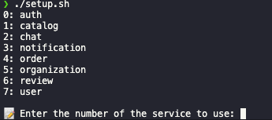
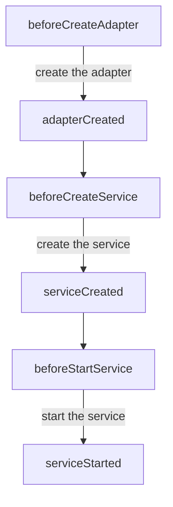
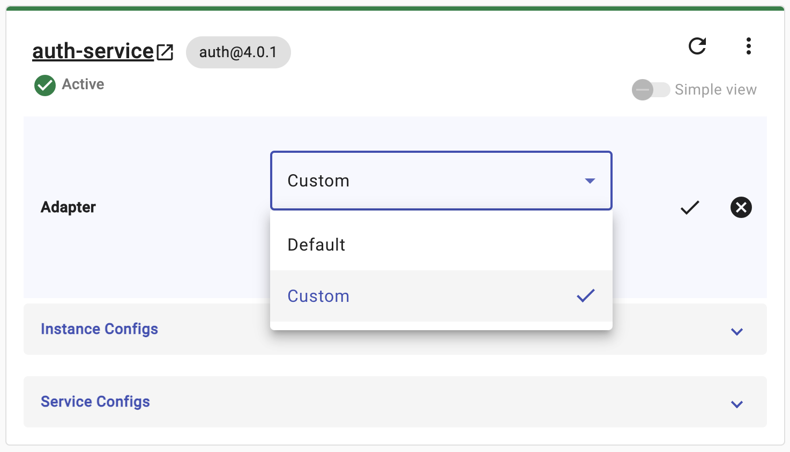
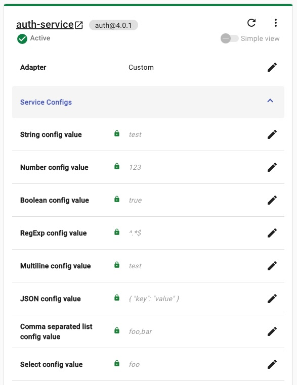

<p align="center">
</p>
<h1 align="center">Nodeblocks Custom Adapter Templates</h1>
<p align="center">Templates for creating the custom adapter of Nodeblocks services on Nodeblocks Cloud</p>

## 📖 Table of Contents
- [Introduction](#🔰-introduction)
- [Features](#✨-features)
- [Setup](#⚙️-setup)
- [Development](#💻-development)
- [Configuration](#🛠️-customization)
- [Deploying to NBC](#🚀-deploying-to-nbc)

## 🔰 Introduction

### What is Nodeblocks

[Nodeblocks](https://docs.nodeblocks.dev/docs/what-is-nodeblocks/introduction) is a low cost application development platform, created to speed up backend development of Web and Mobile platforms. By providing prefabricated services, called **Blocks**, you can focus your development resources solely on your core business logic and use cases, with a high level of freedom in terms of architecture and integration.

### What is Nodeblocks Cloud (NBC)

[Nodeblocks Cloud (NBC)](https://docs.nodeblocks.dev/docs/what-is-nodeblocks/nodeblocks-cloud) is a cloud service that provides a platform to deploy and manage Nodeblocks services. NBC allows you to deploy your Nodeblocks services to the cloud, manage the services, and monitor the performance of the services.

### What is the custom adapter

The custom adapter extends the functionality of Nodeblocks services. Each [Block](https://docs.nodeblocks.dev/docs/what-is-nodeblocks/introduction#blocks) service has the default behavior implemented as an adapter called the **Default Adapter**. The Default Adapter is developed by the Nodeblocks team and is provided as part of the library.

The custom adapter is a user-defined adapter that can be used to customize the behavior of each Block. It can be used to override the default behavior of the service, add new features, or integrate with external services.

[About Adapters](https://docs.nodeblocks.dev/docs/what-is-nodeblocks/introduction#adapters)

## ✨ Features

The template provides the following features:

- The custom adapter templates for Nodeblocks services
- The command to develop the custom adapter locally for development

## ⚙️ Setup

### Install Node.js

This project requires Node.js to be installed on your machine. Install the latest [Node.js](https://nodejs.org/en/download/) 18+ LTS version directly, or via [nvm](https://github.com/nvm-sh/nvm#installing-and-updating).

We support only **[npm](https://www.npmjs.com/)** for the package manager.

### Prepare NPM Auth Token

This project depends on npm packages hosted in a private npm registry.
You will need a `npm auth token` in order to access these packages.
Please prepare this token using the steps below before continuing with setup.

1. Ask Nodeblocks team for a valid `npm auth token`.
1. Add the token as `BASALDEV_AUTH_TOKEN` to your local environment - `.zshrc` `.bashrc` etc

```bash
export BASALDEV_AUTH_TOKEN=__INSERT_YOUR_TOKEN_HERE__
```

### Create a new repository for the custom adapter

First, create a new repository in GitHub for the custom adapter by the `Use this template` button on this repository (See [Creating a repository from a template](https://docs.github.com/en/repositories/creating-and-managing-repositories/creating-a-repository-from-a-template#creating-a-repository-from-a-template)).

### Clone the repository

After creating a repository, clone the repository to your machine

### Select the template for the target Block service

Open the cloned repository and in the terminal, run `./setup.sh` to setup the template for the target Block service.

```bash
./setup.sh
```



Confirm you have the following files in the repository:

```bash
.
├── .templates
├── .gitignore
├── .npmrc
├── docs
├── setup.sh
├── src
│   └── index.ts       # The main entry point of the custom adapter
├── nbc.adapter.json   # The custom adapter manifest used to define the adapter configs on the NBC dashboard
├── nbc.sdk.json       # The configuration file for the Nodeblocks Cloud SDK (The CLI)
├── package-lock.json
├── package.json
└── tsconfig.json
```

### Update the package name

Then, update the `name` field in `package.json` to match your application.

```json
{
  "name": "auth-custom-adapter"
}
```

### Remove the setup files

After that, remove the `setup.sh` and `.templates` files from the repository.

### Install Dependencies

Run the following commands to install the required dependencies:

```bash
npm ci
```

## 💻 Development

### Language

You can develop your custom adapter in either TypeScript (as in the template) or Node.js (JavaScript). The template uses TypeScript but you can switch to raw Node.js by changing `src/index.ts` to `src/index.js`.

### Run the dev server

You can use the dev server to develop the custom adapter locally.

```bash
npm run dev
```

### Environment variables

When you run the command above at the first time, the command creates the `.env.<service>` for you inside the folder. This env file contains the Block service default configs and the adapter configs defined in `nbc.adapter.json`. (See [Adapter configs](#adapter-configs)). 

```bash
# Configs for Block service (prefix SERVICE_)
SERVICE_XXXX

# Configs for the custom adapter (prefix ADAPTER_)
ADAPTER_XXXX
```

You need this file to run the service locally. You can update it as needed. For the deployment to NBC, you need to also update `nbc.adapter.json` so that you can configure the values on NBC dashboard. (See [Adapter configs](#adapter-configs)). 

## 🛠️ Customization

### NBC service hooks

**NBC service hooks** let you customize the behavior of the default adapter of each [Block microservice](https://docs.nodeblocks.dev/docs/what-is-nodeblocks/microservices). Depending on what type of customization you need, you can use the appropriate hook with your custom code.
Before going deeper, make sure you already understand the basic knowledge of how to customize the adapter [here](https://docs.nodeblocks.dev/docs/how-tos/customization/customizing-adapters).

In the main file to be built (index.ts), you can define the following functions as needed.

- `beforeCreateAdapter`: Called before the adapter is created. This hook can be used to customize **the adapter configs**.
- `adapterCreated`: Called after the adapter is created. This hook can be used to customize **the adapter instance**.
- `beforeCreateService`: Called before the service is created. This hook can be used to customize **the service configs**.
- `serviceCreated`: Called after the service is created. This hook can be used to perform **any post service creation tasks**.
- `beforeStartService`: Called before the service is started. This hook can be used to customize **the options for starting the service**.
- `serviceStarted`: Called after the service is started. This hook can be used to perform any **post service starting tasks**.



For more specific guidance on lifecycle hooks, please refer to the `src/index.ts` file of this template repo.

## 🚀 Deploying to NBC

Once you are happy with your custom adapter, push the code to your Github repository and set the repository URL in the NBC editor page, by updating the adapter setting to `custom`.



### Adapter configs

The adapter config file `nbc.adapter.json` defines the environment variables passed into the Block service and the custom adapter.
NBC uses this file to show the adapter configs on the dashboard so that you can configure the custom adapter.



#### The structure of the adapter config file

The config value type can be one of the following:

- string
- number
- boolean
- regexp
- multiline
- json
- commaSeparatedList
- select

```json
{
  "schema": "1.0.0",    // It must be "1.0.0"
  "type": "adapter",    // It must be "adapter"
  "version": "1.0.0",   // It must be "1.0.0"
  "configs": [
    {
      "displayName": "String config value",
      "description": "The example of String type config value.",
      "type": "string",
      "name": "ADAPTER_CUSTOM_STRING", // It must start with "ADAPTER_CUSTOM_"
      "required": false,
      "defaultValue": "test"
    },
    ...
  ]
}
```

You need to have this file even if you don't need any configs. In that case, you can leave the `configs` field as an empty array.

```json
{
  "schema": "1.0.0",
  "type": "adapter",
  "version": "1.0.0",
  "configs": []
}
```


### How the adapter configs used in the custom adapter

You can access the adapter configs through the `process.env` in the custom adapter code.

```javascript
const foo = process.env.ADAPTER_CUSTOM_FOO;
```

### Build code by NBC

NBC runs the `build` script from `package.json` to build the code when deploying the Block service with your custom adapter.

As default, the template has `tsc` which compiles your code in TypeScript. You can customize it as you need and remove it if you don't need the build process, for example in the case of using JavaScript. Run `npm run build` to check if the build runs properly in your local environment.

```bash
{
  "build": "tsc",
}
```